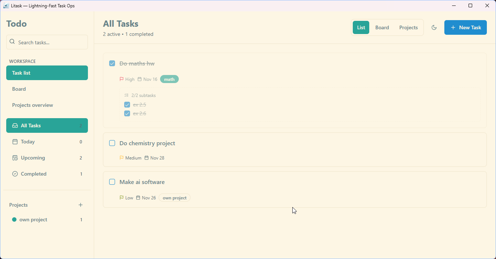
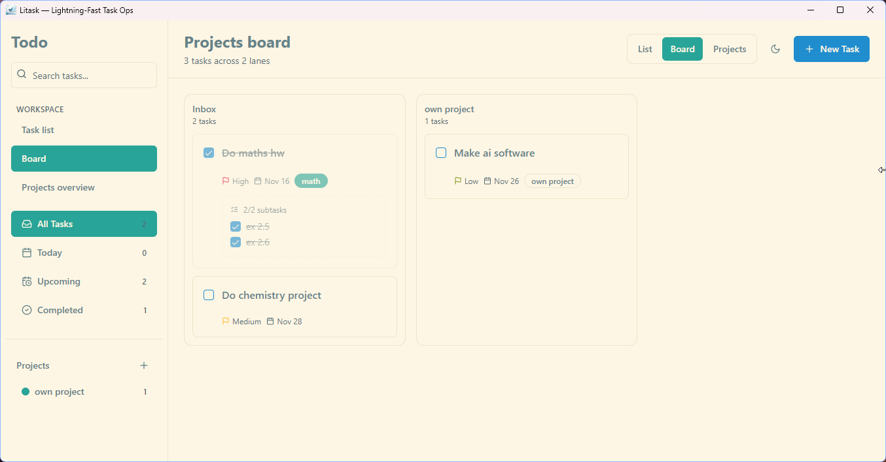
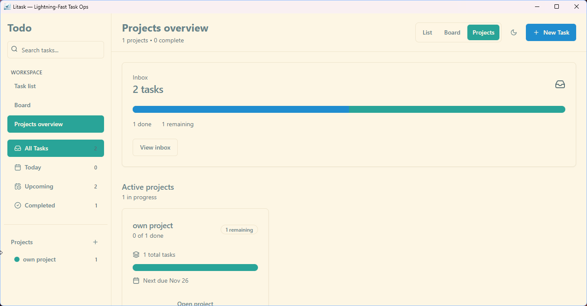

# Litask — The Local-First Task Mission Control


Based on the same solarised theme, modern look ,and max productivity concepts of my [Codetrest — Your Ultimate Markdown-Powered Notes Hub](https://github.com/neptotech/codetrest)  project. Aiming to give modern software at native speed.

Not bragging but with tauri-rust power the overall app is just 10mb and the installers are just 3mb as opposed to the 150mb you would have expected for a web framework based desktop app embedding full chromium. Tauri uses native windows/os web viewer.

Litask turns Tauri into a lightweight productivity cockpit. The desktop shell wraps a React + Tailwind UI that focuses on:

- **Projects overview** – snapshot every initiative with health, owners, and quick stats.
- **Structured task boards** – Kanban-style queues with drag & drop (powered by DnD Kit) and keyboard-friendly dialogs.
- **Deep focus tools** – global command palette, contextual sidebars, color-coded priorities, and theme switching via Radix primitives.
- **Offline-first storage** – the Tauri sidecar persists your data in the Documents folder so everything stays on-device.

Built on a modern React stack (Vite, TypeScript, TanStack Query, shadcn/ui) but delivered as a native-feeling desktop app.

---
## Install as a user  

- Download portable or installer for the project and run from [release page](https://github.com/neptotech/litask/releases) 

---
## Installation & Setup (For developers)

1. **Install [Node.js](https://nodejs.org/)** for the frontend workspace.
2. **Install [Rust](https://www.rust-lang.org/tools/install)** for the Tauri shell.
3. **Install dependencies** (root + `src` thanks to npm workspaces):
   ```bash
   npm install
   ```

---
## Usage

### Development
```bash
npm run tauri dev  # Boots the desktop shell and proxies to the dev server
```

### Production build
```bash
npm run tauri build # Packages the desktop app (runs npm run build first)
```

---
## Feature Highlights
- **Store tasks safely to documents** - Stored in `~/Documents/Litask Data.json`. Which is most likely backed up by onedrive aldready! So you get your content saved to cloud additionally as backup!
- **Commanding navigation** – Palette, sidebar filters, and keyboard shortcuts accelerate project hops.
- **Flexible dialogs** – Create/update tasks with validation (React Hook Form + Zod) and contextual metadata pickers.
- **Visual analytics** – Recharts-powered workload and progress charts plus status badges for quick scanning.
- **First-class theming** – Light/dark/system themes, Radix UI components, and tailwind-merge utility classes keep styling consistent.
- **Desktop superpowers** – File system plugin and local document storage keep work accessible even without a network.



---
## Data Persistence

- On desktop launches, the React context hydrates itself from the Tauri command `load_litask_data`, which reads `Documents/Litask Data.json` and converts timestamps/subtasks back into rich objects.
- Every task/project mutation triggers a debounced `persistState` flow that mirrors the latest state to both localStorage (for the web build) and the Documents JSON file via the `save_litask_data` command.
- If the JSON file is missing or empty, the app falls back to whatever is in localStorage, then rewrites the desktop file so both locations stay in sync.

---
## Notes
- The first Tauri build compiles Rust crates and can take a few minutes.
- `src-tauri/target` and `src/dist` are ignored—run the build commands whenever you need fresh artifacts.
- User data is written to `Documents/Litask Data.json`; delete it if you want a clean slate.
